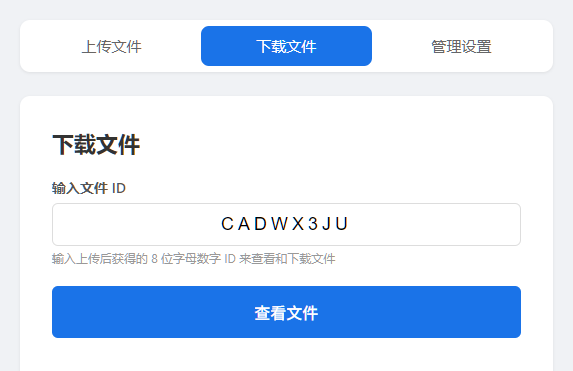
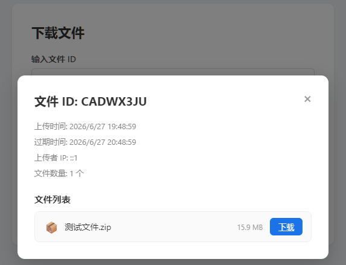
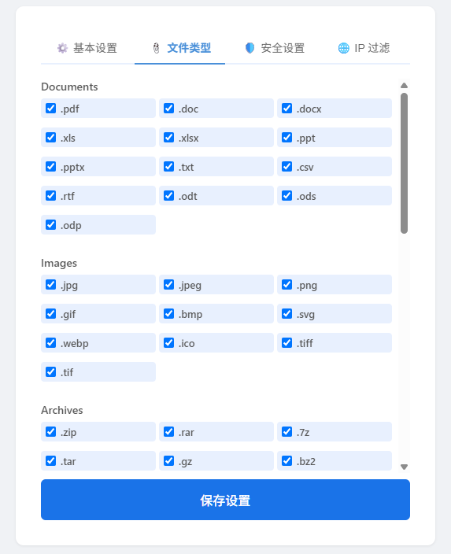
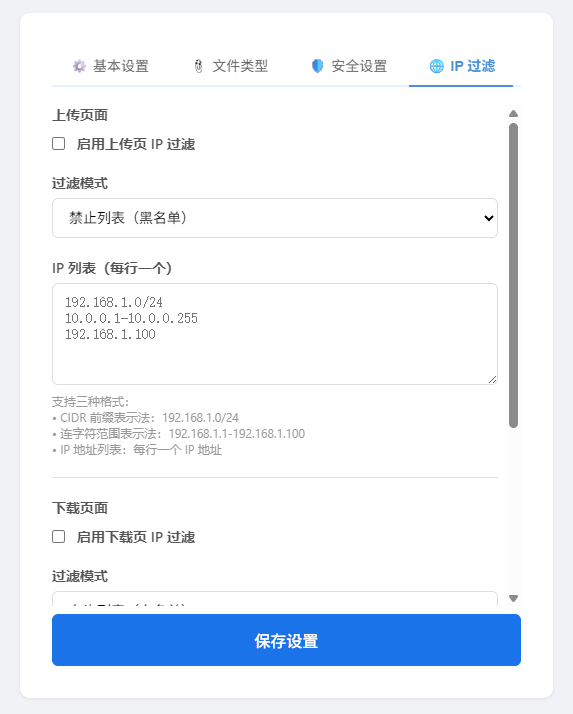

# 文件传输工具 (File Transmission Tool)

一个自托管的文件传输 Web 应用 —— 用户上传文件后获得一个 8 位随机 ID，其他人凭此 ID 即可下载。


## 功能特性

### 管理面板
- **密码保护**：管理员密码在配置文件中设定，进入管理页需验证
- **文件类型管控**：预设常见文档、图片、压缩包、视频、音频、代码等类型，支持自定义扩展名
- **压缩包安全**：可配置是否拦截加密压缩包、是否递归检测、是否通过文件内容（magic bytes）判断文件类型
- **病毒检测**：通过"解压-等待-对比"的侧信道方式检测病毒——解压压缩包后等待杀毒软件处理，若文件数减少则拒绝上传
- **IP 访问控制**：上传/下载可分别配置 IP 白名单或黑名单，支持以下格式：
  - CIDR 前缀：`192.168.1.0/24`
  - 连字符范围：`192.168.1.1-192.168.1.100`
  - 精确匹配：`10.0.0.1`
- **存储路径配置**：Windows 默认 `files`（无 D 盘则自动向后查找），Linux 默认 `/var/usr/FileTransmit/`
- **保留时长**：默认 24 小时，每 30 分钟自动清理过期文件及空目录

### 上传
- 多文件选择 + 拖拽上传
- 重名文件自动添加序号
- 可填写文件描述信息
- 上传后醒目展示 8 位文件 ID，凭此 ID 即可分享/下载
- 浏览器本地记录上传历史，自动清理已失效记录

### 下载
- 输入文件 ID 查看文件详情
- 详情弹窗展示描述、上传者信息（IP、时间、浏览器等）及文件清单
- 点击文件名直接下载

## 技术栈

| 层面 | 技术 |
|------|------|
| 前端 | React (Vite 构建) |
| 后端 | Node.js + Express |
| 数据库 | better-sqlite3 |
| 平台 | Windows / Linux |

## 快速开始

### 方式一：一键脚本

**Windows**：双击 `scripts/start.bat`（自动安装依赖、构建前端、启动服务）

**Linux**：
```bash
chmod +x scripts/start.sh
./scripts/start.sh
```

### 方式二：手动启动

```bash
# 安装依赖
npm install

# 开发模式（前后端热重载）
npm run dev

# 生产模式（先构建再启动）
npm run build
npm start
```

服务默认监听 **3000** 端口，浏览器访问 `http://localhost:3000`。

### 安装为 Windows 服务

以**管理员身份**运行：

```batch
scripts\install-service.bat    # 安装服务
scripts\uninstall-service.bat  # 卸载服务
```

## 使用说明

### 上传文件

1. 打开首页即是上传页面，支持**点击选择文件**或**拖拽文件**到虚线区域
2. 可同时选择多个文件，重名文件会自动添加序号（如 `file(1).txt`）
3. 在底部输入框填写文件描述（可选），便于接收方了解文件内容
4. 点击"开始上传"，等待进度条完成


### 分享文件

上传成功后，页面会显示一个醒目的 **8 位文件 ID**（如 `A3bF9kQ2`），点击即可复制。将这个 ID 通过任意方式（微信、邮件等）发送给接收方即可。


你也可以点击右上角的**时钟图标**查看本地上传历史，批量验证哪些 ID 仍有效。

### 下载文件

1. 接收方打开网站，切换到**下载文件**页面
2. 输入 8 位文件 ID，点击"查看文件"



3. 弹出文件详情窗口，展示描述信息和文件列表



4. 点击文件名即可下载

### 管理设置

在页面顶部导航栏点击**管理设置**，输入管理员密码登录。


#### 文件类型控制

勾选允许上传的文件类别，或在下方的"自定义扩展名"中添加额外的扩展名。未勾选的类型将被拒绝上传。



#### 安全设置

- **拦截加密压缩包**：拒绝需要密码才能解压的压缩包，防止病毒绕过扫描
- **通过文件内容检测压缩包类型**：读取文件头（magic bytes）判断真实类型，而非仅依赖扩展名
- **递归检测压缩包内文件**：解压并检查压缩包内每一层文件的类型是否合法

- **7-Zip 路径**：用于压缩包递归检测的 7z.exe 路径
- **病毒检测**：上传后自动解压压缩包到临时目录，根据文件数量自动决定等待时长（10~60秒），若文件数减少则判定杀毒软件删除了病毒文件，拒绝该上传并自动清理


#### IP 访问控制

可为上传和下载分别配置 IP 过滤规则：

- **模式切换**：
  - **拒绝模式（deny）**：禁止列表中的 IP 访问，其余放行（黑名单）
  - **允许模式（allow）**：仅允许列表中的 IP 访问，其余拒绝（白名单）
- **地址格式**：支持 CIDR（`192.168.1.0/24`）、范围（`192.168.1.1-192.168.1.100`）、精确匹配（`10.0.0.1`）
- **启用开关**：关闭后 IP 过滤不生效



#### 存储与保留

- **存储路径**：文件在服务器上的存放目录，支持相对路径和绝对路径
- **保留时长**：文件上传后保留的小时数，超时自动清理（每 30 分钟执行一次清理任务）

## 配置说明

首次启动后会在项目根目录自动生成 `config.json`，主要配置项：

```json
{
  "port": 3000,
  "adminPassword": "admin123",
  "storagePath": "files",
  "retentionHours": 24,
  "allowedFileTypes": {
    "documents": [".pdf", ".doc", ".docx", ".xls", ".xlsx", ".ppt", ".pptx", ".txt", ".csv", ".rtf", ".odt", ".ods", ".odp"],
    "images": [".jpg", ".jpeg", ".png", ".gif", ".bmp", ".svg", ".webp", ".ico", ".tiff", ".tif"],
    "archives": [".zip", ".rar", ".7z", ".tar", ".gz", ".bz2", ".xz", ".iso"],
    "videos": [".mp4", ".avi", ".mov", ".wmv", ".flv", ".webm", ".m4v", ".mkv"],
    "audio": [".mp3", ".wav", ".flac", ".aac", ".ogg", ".wma", ".m4a"],
    "code": [".js", ".ts", ".jsx", ".tsx", ".py", ".java", ".c", ".cpp", ".h", ".cs", ".go", ".rs", ".rb", ".php", ".html", ".css", ".json", ".xml", ".yaml", ".yml", ".sql", ".sh", ".bat", ".ps1"],
    "custom": []
  },
  "blockEncryptedArchives": true,
  "detectArchiveByContent": true,
  "recursiveArchiveCheck": true,
  "enableVirusDetect": false,
  "sevenZipPath": "C:\\Program Files\\7-Zip\\7z.exe",
  "ipFilter": {
    "upload": { "enabled": false, "mode": "deny", "list": [] },
    "download": { "enabled": false, "mode": "allow", "list": [] }
  }
}
```

> **注意**：启动后请立即修改 `adminPassword`，默认密码为 `admin123`。

## 项目结构

```
file-transmit/
├── server/
│   ├── index.js              # Express 入口
│   ├── config.js             # 配置读写与默认值
│   ├── db.js                 # 数据库初始化与查询
│   ├── middleware/
│   │   ├── userId.js         # 永久 Cookie 用户标识
│   │   ├── ipFilter.js       # IP 黑白名单中间件
│   │   └── auth.js           # 管理员认证中间件
│   ├── routes/
│   │   ├── admin.js          # 管理 API
│   │   ├── upload.js         # 上传 API
│   │   └── download.js       # 下载 API
│   ├── services/
│   │   ├── cleanup.js        # 定期清理过期文件
│   │   └── archiveCheck.js   # 压缩包检测与病毒检测（解压-等待-对比）
│   └── utils/
│       └── ipMatch.js        # IP 匹配工具
├── client/
│   └── src/
│       ├── pages/
│       │   ├── UploadPage.jsx     # 上传页
│       │   ├── DownloadPage.jsx   # 下载页
│       │   └── AdminPage.jsx      # 管理页
│       └── components/
│           ├── PasswordModal.jsx   # 管理员登录弹窗
│           ├── FileDetailModal.jsx # 文件详情弹窗
│           └── HistoryButton.jsx   # 上传历史按钮
├── config.json              # 运行时配置文件
├── screenshots/             # 截图文档
└── scripts/                 # 启动与服务管理脚本
```

## API 概览

| 方法 | 路径 | 说明 |
|------|------|------|
| POST | `/api/admin/login` | 管理员登录 |
| GET | `/api/admin/settings` | 获取配置 |
| PUT | `/api/admin/settings` | 更新配置 |
| GET | `/api/admin/stats` | 获取统计信息 |
| POST | `/api/upload/files` | 上传文件 |
| GET | `/api/upload/history` | 查询上传历史 |
| GET | `/api/upload/validate-ids` | 批量验证文件 ID 有效性 |
| GET | `/api/download/:fileId` | 查看文件详情 |
| GET | `/api/download/:fileId/:fileName` | 下载文件 |

## 许可

[MIT License](LICENSE)
